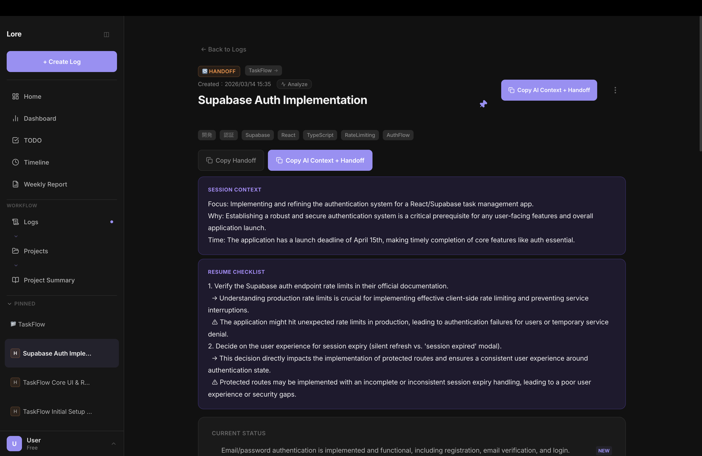
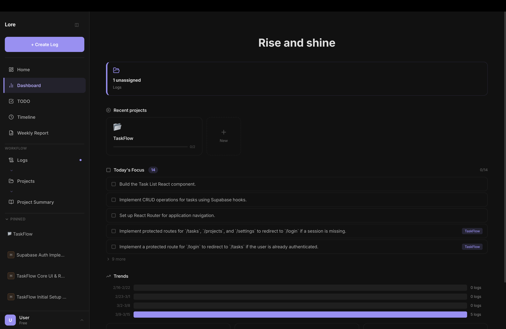
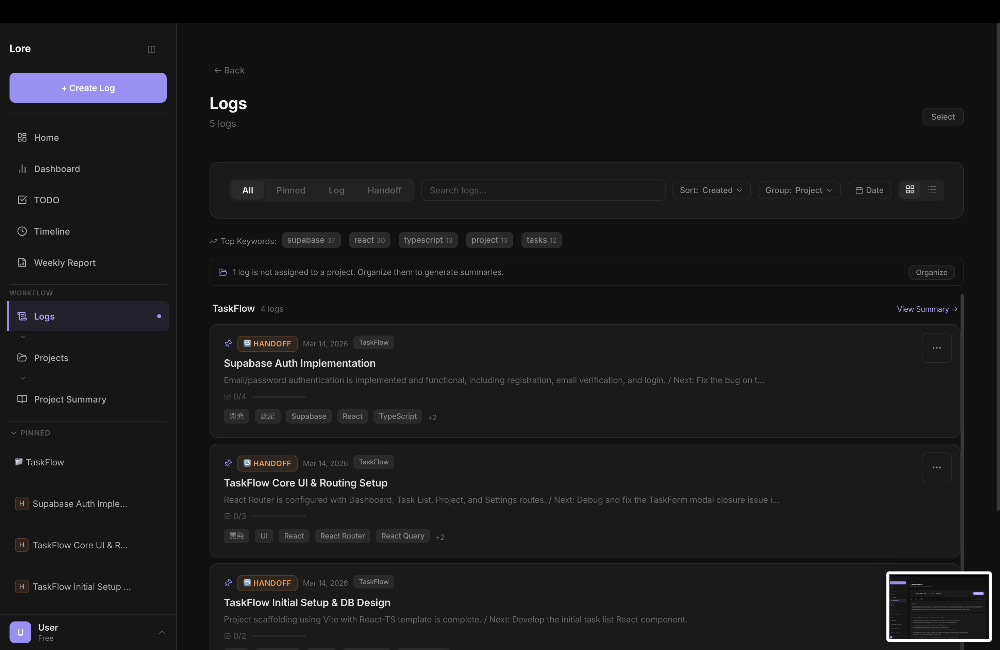
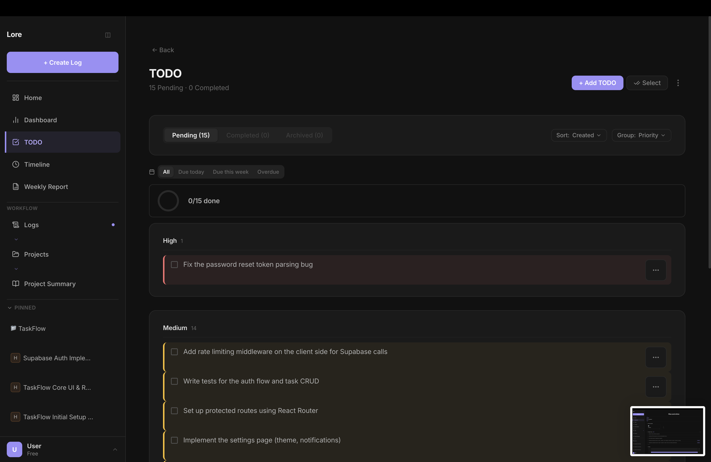
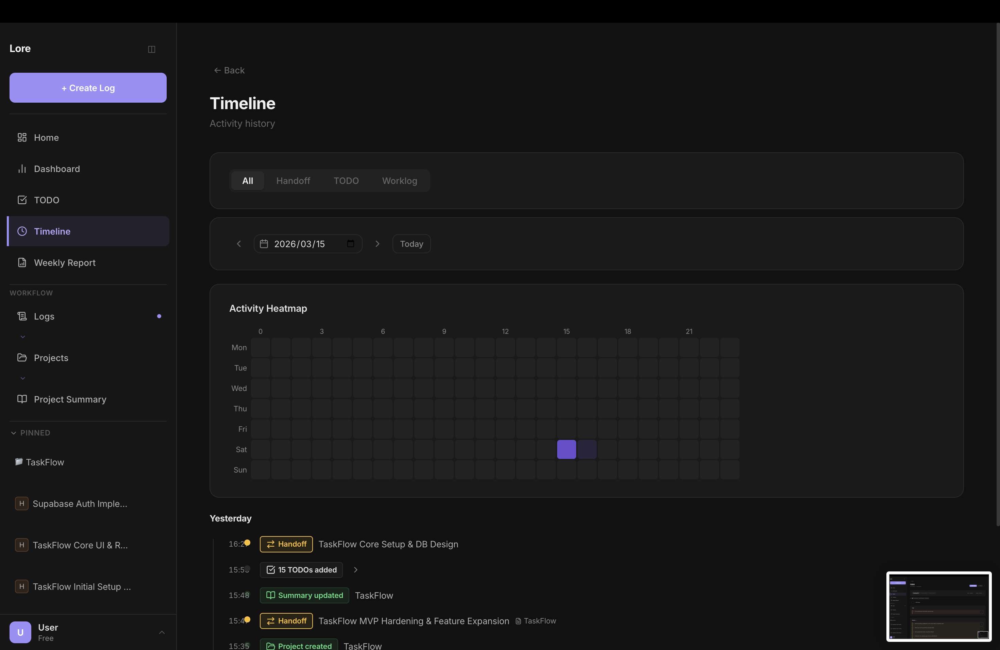
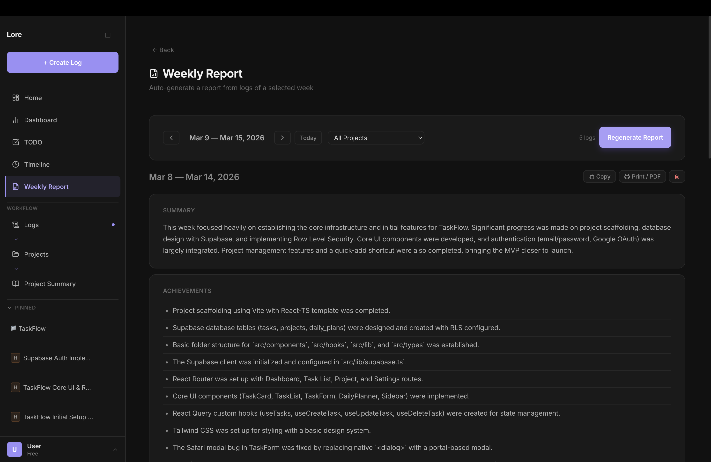
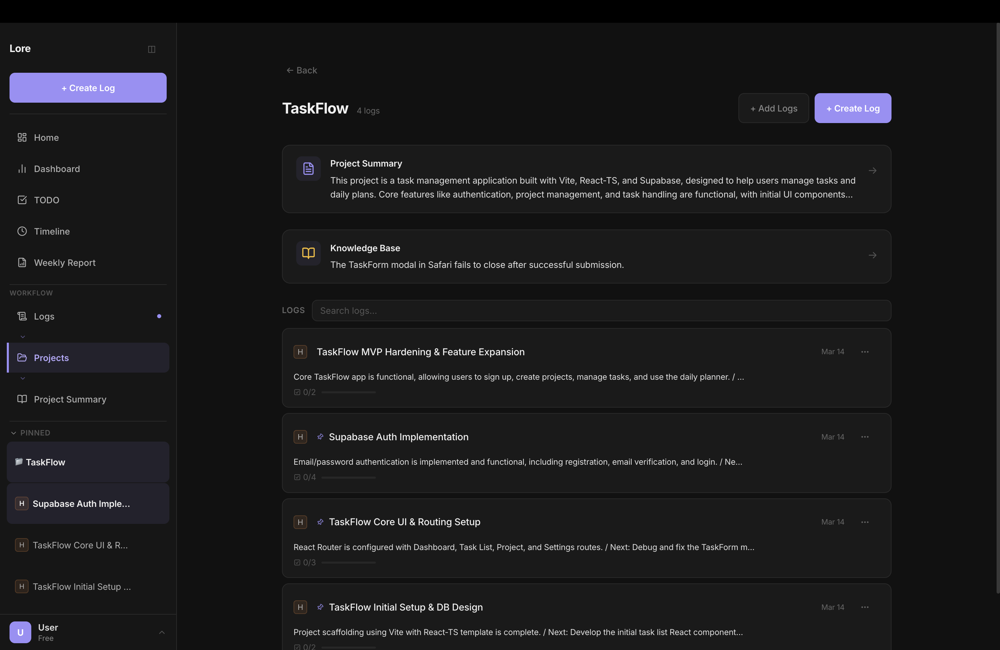

<h1 align="center">Lore</h1>

<p align="center">
  <a href="https://github.com/nao-lore/lore-app/actions"></a>
  <a href="https://github.com/nao-lore/lore-app/blob/main/LICENSE"></a>
</p>

<p align="center">
  <strong>Structured context for every AI session</strong><br/>
  Your AI doesn't need to remember everything. It needs to know where you are.
</p>

<p align="center">
  <a href="https://loresync.dev">Live App</a> ·
  <a href="#features">Features</a> ·
  <a href="#getting-started">Getting Started</a> ·
  <a href="#chrome-extension">Chrome Extension</a>
</p>

<p align="center">
  
</p>

---

## What is Lore?

Lore turns AI conversations into structured project context — so you and your AI always know exactly where things stand.

Paste your ChatGPT / Claude / Gemini conversation into Lore, and it automatically generates:

- **Project Snapshot** — Current status, key decisions, risks, and blockers at a glance
- **Next Actions** — Tasks auto-extracted and organized by priority
- **Project Summary** — A living dashboard built from all your sessions
- **AI Context** — Structured context your next AI session can instantly understand

## Screenshots

<details>
<summary>Click to expand</summary>

### Dashboard


### Logs


### Handoff Detail


### TODO Management


### Timeline


### Weekly Report


### Project Detail


</details>

## Features

**Core**
- One-click handoff generation from any AI conversation
- Auto-extracted TODOs with priority, due dates, and source tracking
- Project Summary that evolves as you add more handoffs
- AI Context: copy & paste into your next session for instant context sharing

**Organization**
- Projects with custom icons and colors
- Pin frequently-used projects and logs
- Tag-based filtering and full-text search (⌘K)
- Timeline view across logs, TODOs, and summaries
- Dashboard with today's focus, blockers, and overdue tasks

**Input**
- Paste text directly
- Import files (.txt, .md, .docx, .json) via drag & drop
- Chrome extension for one-click capture from ChatGPT, Claude, and Gemini

**Extras**
- Weekly Report auto-generation
- Knowledge Base extraction (recurring patterns & decisions)
- Notion & Slack integrations
- PWA — installable on desktop and mobile
- 8 languages: English, 日本語, Español, Français, Deutsch, 中文, 한국어, Português

## Getting Started

### Use the hosted version

Go to **[loresync.dev](https://loresync.dev)** — no signup required.

1. Set up a free Gemini API key at [aistudio.google.com](https://aistudio.google.com)
2. Paste it in Settings
3. Paste an AI conversation and hit "Transform to Handoff"

> **No API key?** Select "Try without API key" during onboarding to explore Lore with pre-generated sample data.

### Run locally

```bash
git clone https://github.com/nao-lore/lore-app.git
cd lore-app
npm install
npm run dev
```

Open `http://localhost:5173`.

### Build for production

```bash
npm run build    # outputs to dist/
npm run preview  # preview production build
```

### Tests

```bash
npm test         # unit tests (Vitest)
```

## Chrome Extension

The `extension/` directory contains a Chrome extension that adds a "Send to Lore" button on ChatGPT, Claude, and Gemini pages.

To install locally:
1. Go to `chrome://extensions`
2. Enable "Developer mode"
3. Click "Load unpacked" and select the `extension/` folder

## Tech Stack

| Layer | Tech |
|-------|------|
| Framework | React 19 + TypeScript (strict) |
| Build | Vite 7 |
| Testing | Vitest + Playwright |
| Storage | localStorage (database migration planned) |
| Deploy | Vercel |
| PWA | vite-plugin-pwa |

## Data & Privacy

- All data is stored in your browser's localStorage
- API keys never leave your browser — they're sent directly to the AI provider
- No analytics, no tracking, no accounts required
- Export/import your data anytime from Settings

## Feedback

Found a bug or have a suggestion? [Open an issue](https://github.com/nao-lore/lore-app/issues/new/choose) or use the in-app feedback button (Help → Feedback).

## License

MIT
